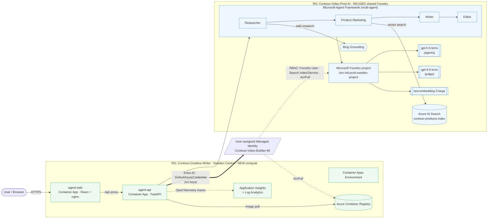

# Architecture at a glance

Contoso Creative Writer — modernized to the Microsoft Agent Framework and deployed
as a secure Azure Container Apps service that **reuses** an existing Microsoft
Foundry project for all AI, and hosts only the frontends/compute in a new
resource group.

## How the request flows
1. The user opens **agent-web** (React) and submits a topic + instructions.
2. **agent-web** proxies to **agent-api** (FastAPI), which runs the multi-agent
   workflow on the **Microsoft Agent Framework**:
   **Researcher** (Bing grounding) → **Product Marketing** (Azure AI Search
   vector retrieval) → **Writer** → **Editor** (with a feedback loop).
3. The agents call the Foundry models (`gpt-5.6-terra`, embeddings
   `text-embedding-3-large`) in the reused project.
4. Traces (agents, tools, model calls) are exported via **OpenTelemetry** to
   **Application Insights** and surface in the Foundry Agent Monitor.

## Security posture
- **Passwordless**: the app authenticates with **Microsoft Entra ID** via
  `DefaultAzureCredential` bound to the shared **user-assigned managed identity** —
  no API keys anywhere.
- **Least-privilege RBAC** on the identity: Foundry User (models + Bing),
  Search Index Data Contributor + Search Service Contributor (product retrieval),
  AcrPull (image pull).
- **HTTPS-only** ingress on both Container Apps; images come from a private ACR
  pulled with the managed identity.
- **CI/CD** (GitHub Actions) uses **OIDC federation** — no stored secrets.
- AI resources are **reused, not duplicated** — one Foundry, one identity.
